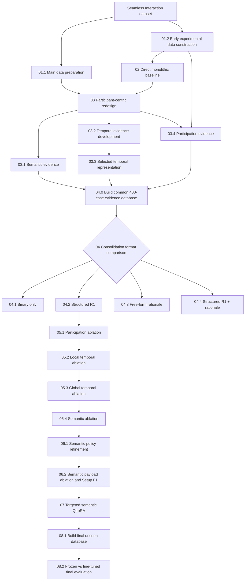

# Participant-Centric Evidence Consolidation for Dyadic Conversational Anomaly Detection with Multimodal LLMs

This repository contains the code and experimental notebooks accompanying the MSc dissertation **“Participant-Centric Evidence Consolidation for Dyadic Conversational Anomaly Detection with Multimodal LLMs.”**

The project investigates conversation-level anomaly detection in dyadic audiovisual interactions using **Qwen2.5-Omni-7B**. Three controlled anomaly families are considered: **Wrong Partner**, **Lag Partner**, and **Silent Partner**. The final framework analyses participants independently, constructs structured **semantic, temporal, and participation evidence**, and consolidates these evidence sources for conversation-level classification.

This README acts as a guide to the submitted supporting material. It maps the experiments reported in the dissertation to the corresponding notebooks, explains the order in which the notebooks relate to one another, and lists the data, cached artifacts, model files, and other resources required to reproduce each stage.

## Dissertation Report

The complete methodology, experimental analysis, results, discussion, and conclusions are available in the dissertation report:

**[MSc Dissertation Report](report/Final_Report.pdf)**

> **Note:** The repository contains the experimental code and saved notebook outputs. Large audiovisual data, model checkpoints, and some intermediate cached artifacts are not distributed directly with the repository. The required inputs for each notebook are documented below.

## Experimental Pipeline and Notebook Map

The diagram below summarises the experimental progression of the dissertation. Each number shown before an experimental stage is a repository stage identifier; the same identifier is used in the table below to map that stage to its exact notebook file.

### Notebook mapping

| Stage | Notebook |
|---|---|
| **01.1** | `01_data_preparation/01_download_and_preprocess_seamless_interaction.ipynb` |
| **01.2** | `01_data_preparation/02_build_early_experimental_datasets.ipynb` |
| **02** | `02_direct_baseline/01_direct_monolithic_video_only_baseline.ipynb` |
| **03.1** | `03_isolated_branches/01_semantic_normal_vs_wrong_partner.ipynb` |
| **03.2** | `03_isolated_branches/02_temporal_full_development_pipeline.ipynb` |
| **03.3** | `03_isolated_branches/03_temporal_selected_representation_reported_isolated_result.ipynb` |
| **03.4** | `03_isolated_branches/04_participation_branch_development.ipynb` |
| **04.0** | `04_consolidation/00_build_consolidation_evidence_database.ipynb` |
| **04.1** | `04_consolidation/01_binary_only_consolidation.ipynb` |
| **04.2** | `04_consolidation/02_structured_r1_consolidation.ipynb` |
| **04.3** | `04_consolidation/03_free_form_rationale_consolidation.ipynb` |
| **04.4** | `04_consolidation/04_structured_r1_with_free_form_rationale_consolidation.ipynb` |
| **05.1** | `05_ablations/participation/01_participation_branch_ablation.ipynb` |
| **05.2** | `05_ablations/temporal/02_local_temporal_branch_ablation.ipynb` |
| **05.3** | `05_ablations/temporal/03_global_temporal_branch_ablation.ipynb` |
| **05.4** | `05_ablations/semantic/04_semantic_branch_ablation.ipynb` |
| **06.1** | `06_setup_f1/01_semantic_policy_refinement.ipynb` |
| **06.2** | `06_setup_f1/02_setup_f1_semantic_payload_ablation.ipynb` |
| **07** | `07_finetuning/01_targeted_semantic_qlora_finetuning.ipynb` |
| **08.1** | `08_final_source_disjoint_evaluation/01_build_final_unseen_source_disjoint_database.ipynb` |
| **08.2** | `08_final_source_disjoint_evaluation/02_frozen_vs_finetuned_final_source_disjoint_evaluation.ipynb` |

The numbering follows the repository structure. The sections below explain what each notebook does, which dissertation experiment it corresponds to, what inputs it requires, what artifacts it produces, and which subsequent notebooks depend on it.

## Data, Models and Reproducibility Requirements

This repository does not include the large raw and processed audiovisual files, model checkpoints, or all generated intermediate artifacts used during the experiments.

To reproduce the work:

- The **Seamless Interaction** dataset must first be obtained from its original source.
- The large audiovisual files are not redistributed through this repository.
- Several notebooks depend on generated or cached JSON artifacts produced by earlier stages of the pipeline.
- Whenever an intermediate artifact is not included in the repository, the notebook responsible for generating it is explicitly identified in the notebook guide below.
- The experiments require **Qwen2.5-Omni-7B** and a suitable GPU environment for practical inference and fine-tuning.
- Some notebooks contain environment-specific or hard-coded file paths that must be adapted to the user's local or cloud storage configuration.
- Executed notebook outputs are retained where relevant so that the submitted repository documents the experiments that were actually run and the results reported in the dissertation.

The repository should therefore be reproduced **sequentially rather than as a collection of independent notebooks**. A user wishing to reproduce the complete experimental pipeline should follow the notebook order documented below, since later stages consume datasets, summaries, temporal features, structured evidence databases, or model artifacts generated by earlier stages.

The following notebook-by-notebook guide specifies, for every submitted notebook:

- its role in the dissertation;
- the inputs and previously generated artifacts it requires;
- the outputs it produces;
- the reported experiment or result associated with it;
- and the subsequent notebook(s) that depend on those outputs.