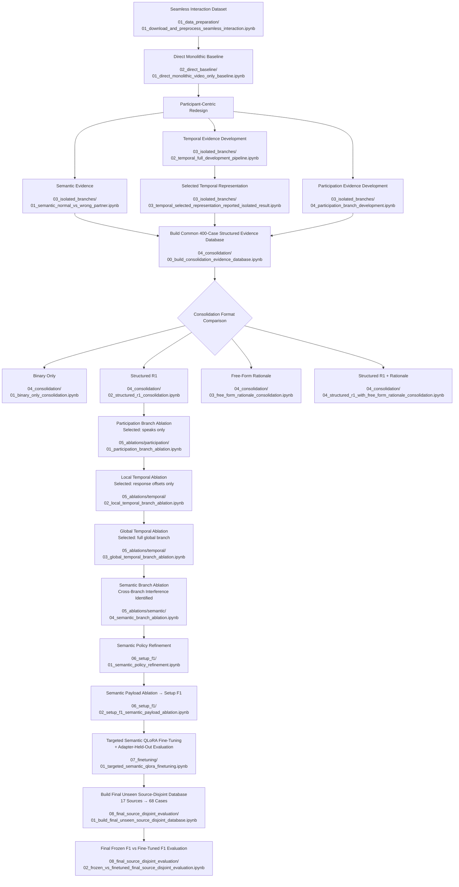

# Participant-Centric Evidence Consolidation for Dyadic Conversational Anomaly Detection with Multimodal LLMs

This repository contains the code and experimental notebooks accompanying the MSc dissertation **“Participant-Centric Evidence Consolidation for Dyadic Conversational Anomaly Detection with Multimodal LLMs.”**

The project investigates conversation-level anomaly detection in dyadic audiovisual interactions using **Qwen2.5-Omni-7B**. Three controlled anomaly families are considered: **Wrong Partner**, **Lag Partner**, and **Silent Partner**. The final framework analyses participants independently, constructs structured **semantic, temporal, and participation evidence**, and consolidates these evidence sources for conversation-level classification.

This README acts as a guide to the submitted supporting material. It maps the experiments reported in the dissertation to the corresponding notebooks, explains the order in which the notebooks relate to one another, and lists the data, cached artifacts, model files, and other resources required to reproduce each stage.

## Dissertation Report

The complete methodology, experimental analysis, results, discussion, and conclusions are available in the dissertation report:

**[MSc Dissertation Report](report/Final_Report.pdf)**

> **Note:** The repository contains the experimental code and saved notebook outputs. Large audiovisual data, model checkpoints, and some intermediate cached artifacts are not distributed directly with the repository. The required inputs for each notebook are documented below.

## Experimental Pipeline and Notebook Map

The diagram below shows the experimental progression of the dissertation and maps each major stage to the corresponding notebook(s) in this repository.

The repository folders are numbered according to this progression. Later sections of this README describe, for each notebook, its role in the dissertation, required inputs, generated outputs, reported results, and dependencies on earlier stages.