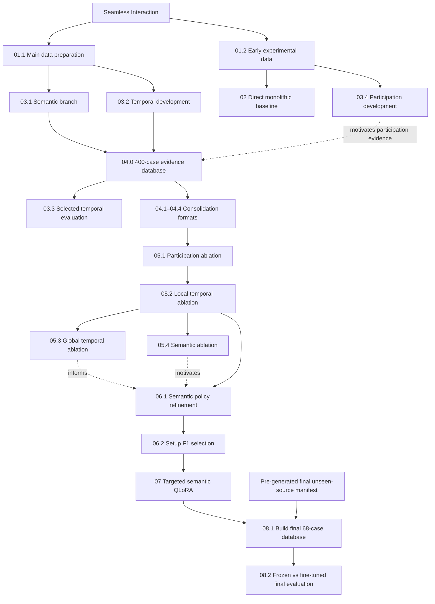

# Participant-Centric Evidence Consolidation for Dyadic Conversational Anomaly Detection with Multimodal LLMs

This repository contains the experimental notebooks accompanying the MSc dissertation **“Participant-Centric Evidence Consolidation for Dyadic Conversational Anomaly Detection with Multimodal LLMs.”**

The project studies dyadic conversational anomaly detection with **Qwen2.5-Omni-7B** for three controlled anomaly families:

* **Wrong Partner** — semantic inconsistency;
* **Lag Partner** — temporal desynchronisation;
* **Silent Partner** — missing spoken participation.

The final framework analyses participants independently, constructs structured **semantic, temporal, and participation evidence**, and consolidates these evidence sources for conversation-level classification.

This README is intended as a **guide to the submitted supporting material**: it maps dissertation experiments to notebooks and documents the main dependencies, generated artifacts, and reported results required to understand or reproduce the experimental pipeline.

---

## Dissertation Report

The complete methodology, analysis, results, discussion, and conclusions are available in:

**[MSc Dissertation Report](report/Final_Report.pdf)**

> Large audiovisual files, model checkpoints, and most generated caches are not distributed in this repository. Executed notebook outputs are retained where relevant. Paths shown below correspond to the original Google Colab / Google Drive environment and should be adapted when reproducing the work elsewhere.

---

## Reproduction Environment

The experiments were run primarily in **Google Colab** with GPU acceleration.

Common requirements include:

* **Qwen2.5-Omni-7B**
* PyTorch / Transformers
* `qwen-omni-utils`
* FFmpeg / FFprobe
* PEFT / bitsandbytes for QLoRA stages
* packages listed in `requirements.txt`

For readability, the following aliases are used below:

```text
DRIVE = /content/drive/MyDrive

DATA  = DRIVE/seamless_download/data

MODEL = DRIVE/Qwen2.5-Omni-7B

SEM   = DRIVE/qwen_strategy2/
        normal_vs_wrong_balanced_100_100_seed42_v1

WORK  = DRIVE/qwen_vad_turns_normal_vs_mixed_lag_1_2_3sec

FINAL = DRIVE/final_test_completely_unseen_database
```

The repository should be reproduced **sequentially**, because later notebooks consume artifacts generated by earlier stages.

---

## Experimental Pipeline



---

## Notebook Map

| Stage    | Notebook                                                                                            | Main dissertation link  |
| -------- | --------------------------------------------------------------------------------------------------- | ----------------------- |
| **01.1** | `01_data_preparation/01_download_and_preprocess_seamless_interaction.ipynb`                         | III-B, III-D            |
| **01.2** | `01_data_preparation/02_build_early_experimental_datasets.ipynb`                                    | IV-A, IV-C.3            |
| **02**   | `02_direct_baseline/01_direct_monolithic_video_only_baseline.ipynb`                                 | IV-A, IV-B              |
| **03.1** | `03_isolated_branches/01_semantic_normal_vs_wrong_partner.ipynb`                                    | IV-C.1, V-A, Table I(a) |
| **03.2** | `03_isolated_branches/02_temporal_full_development_pipeline.ipynb`                                  | III-B–D, IV-C.2         |
| **03.3** | `03_isolated_branches/03_temporal_selected_representation_reported_isolated_result.ipynb`           | V-B, Table I(b)         |
| **03.4** | `03_isolated_branches/04_participation_branch_development.ipynb`                                    | IV-C.3, V-C, Table I(c) |
| **04.0** | `04_consolidation/00_build_consolidation_evidence_database.ipynb`                                   | III-C–D, IV-D           |
| **04.1** | `04_consolidation/01_binary_only_consolidation.ipynb`                                               | V-D, Table II           |
| **04.2** | `04_consolidation/02_structured_r1_consolidation.ipynb`                                             | V-D, Table II           |
| **04.3** | `04_consolidation/03_free_form_rationale_consolidation.ipynb`                                       | V-D, Table II           |
| **04.4** | `04_consolidation/04_structured_r1_with_free_form_rationale_consolidation.ipynb`                    | V-D, Table II           |
| **05.1** | `05_ablations/participation/01_participation_branch_ablation.ipynb`                                 | V-E, Table III          |
| **05.2** | `05_ablations/temporal/02_local_temporal_branch_ablation.ipynb`                                     | V-E, Table III          |
| **05.3** | `05_ablations/temporal/03_global_temporal_branch_ablation.ipynb`                                    | V-E, Table III          |
| **05.4** | `05_ablations/semantic/04_semantic_branch_ablation.ipynb`                                           | V-E–F, Table III        |
| **06.1** | `06_setup_f1/01_semantic_policy_refinement.ipynb`                                                   | V-F–G, Table IV         |
| **06.2** | `06_setup_f1/02_setup_f1_semantic_payload_ablation.ipynb`                                           | V-G, Table IV           |
| **07**   | `07_finetuning/01_targeted_semantic_qlora_finetuning.ipynb`                                         | IV-F, V-H, Table V      |
| **08.1** | `08_final_source_disjoint_evaluation/01_build_final_unseen_source_disjoint_database.ipynb`          | III-D, V-I              |
| **08.2** | `08_final_source_disjoint_evaluation/02_frozen_vs_finetuned_final_source_disjoint_evaluation.ipynb` | V-I, Table VI           |

---

# Stage-by-Stage Guide

## 01 — Data Preparation

### 01.1 Main Data Preparation

**Notebook:**
`01_data_preparation/01_download_and_preprocess_seamless_interaction.ipynb`

**Purpose:** Main entry point for the systematic participant-centric pipeline. Downloads and preprocesses the Seamless Interaction Improvised test split and stores participant-specific audiovisual records.

**Requires:** access to the original Seamless Interaction dataset.

**Produces:**

```text
DATA/
```

containing the processed participant-centric audiovisual files and metadata used by the systematic experiments.

This notebook provides the data foundation for Sections **III-B** and **III-D**.

---

### 01.2 Early Experimental Data Construction

**Notebook:**
`01_data_preparation/02_build_early_experimental_datasets.ipynb`

This notebook preserves the separate data route used during the early exploratory experiments.

**Produces:**

```text
DRIVE/dataset.zip
```

Split-concatenated NORMAL / Wrong Partner dyads used by **Stage 02**.

```text
DRIVE/data.zip
```

Participant-separated MP4/WAV/JSON records used by the early **Stage 03.4 participation experiment**.

These archives are historical experimental representations and are not required by the later systematic 400-case pipeline.

---

## 02 — Direct Monolithic Baseline

**Notebook:**
`02_direct_baseline/01_direct_monolithic_video_only_baseline.ipynb`

**Report:** Sections **IV-A–B**.

**Requires:** `DRIVE/dataset.zip`, Qwen2.5-Omni-7B, GPU.

The model receives the combined split-concatenated `.mp4` directly. The historical filename uses “video-only”, although the submitted MP4 retains embedded audio.

**Output:**

```text
DRIVE/qwen_split_concat_video_only/outputs_ensemble/
```

**Result:**

```text
NORMAL         30/30
Wrong Partner   1/30
Overall        31/60 = 51.67%
```

The strong NORMAL bias motivates the participant-centric redesign.

---

# 03 — Isolated Participant-Centric Evidence

## 03.1 Semantic Evidence

**Notebook:**
`03_isolated_branches/01_semantic_normal_vs_wrong_partner.ipynb`

**Report:** Sections **IV-C.1**, **V-A**, Table **I(a)**.

**Requires:** `DATA`, Qwen2.5-Omni-7B, GPU.

**Produces:** coarse and focused participant semantic-summary caches under:

```text
SEM/outputs/
```

These caches are reused during Stage 04.0 and final-test construction.

**Results:**

| Representation       |  Accuracy |
| -------------------- | --------: |
| Coarse only          |     84.5% |
| Focused only         |     73.5% |
| **Coarse + focused** | **86.5%** |

---

## 03.2 Temporal Evidence Development

**Notebook:**
`03_isolated_branches/02_temporal_full_development_pipeline.ipynb`

**Report:** Sections **III-B–D**, **IV-C.2**.

**Requires:** `DATA`, participant VAD metadata, Qwen2.5-Omni-7B.

This notebook establishes the systematic temporal protocol:

```text
206 complete dyads
→ 167 eligible
→ 50 frozen temporal-reference sources
→ 100 development sources
→ 17 reserved final sources
```

It develops local response offsets, overlap and global-alignment features.

**Key outputs under `WORK/`:**

```text
reference_50_conversations.json
heldout_100_conversations.json
frozen_reference_base_statistics.json
frozen_reference_global_shift_statistics.json
```

These artifacts are reused throughout the remaining pipeline.

---

## 03.3 Selected Temporal Representation

**Notebook:**
`03_isolated_branches/03_temporal_selected_representation_reported_isolated_result.ipynb`

**Report:** Section **V-B**, Table **I(b)**.

The selected representation retains:

```text
response-offset statistics
+ complete global alignment features
+ frozen NORMAL references
```

and removes filtered-turn lists and overlap from the model-facing payload.

**Requires:** Stage 03.2 frozen references, the Stage 04.0 400-case database, Qwen2.5-Omni-7B.

> Although this is presented as an isolated-branch experiment, exact reproduction of the submitted notebook requires the Stage 04.0 database because its 200 evaluation cases are selected from that cached database.

**Result:**

```text
NORMAL      83/100
LAG         88/100
Overall    171/200 = 85.5%
```

---

## 03.4 Participation Branch Development

**Notebook:**
`03_isolated_branches/04_participation_branch_development.ipynb`

**Report:** Sections **IV-C.3**, **V-C**, Table **I(c)**.

**Requires:** `DRIVE/data.zip`, Qwen2.5-Omni-7B.

This early 30/30/30 study showed that visual engagement alone could cause Silent Partners to be interpreted as speaking. Explicit participant-specific VAD/metadata grounding motivated the final compact:

```text
speaks
```

participation field.

| Configuration       |    NORMAL | Wrong Partner |    Silent |
| ------------------- | --------: | ------------: | --------: |
| Coarse only         |     24/30 |         30/30 |      7/30 |
| **Coarse + speaks** | **28/30** |     **30/30** | **28/30** |

---

# 04 — Structured Evidence Consolidation

## 04.0 Build Common 400-Case Evidence Database

**Notebook:**
`04_consolidation/00_build_consolidation_evidence_database.ipynb`

**Report:** Sections **III-C–D**, **IV-D**.

This is the central data-building notebook for all consolidation, ablation and Setup-F1 experiments.

**Requires:**

```text
DATA
Stage 03.1 semantic caches
Stage 03.2 split/reference artifacts
Qwen2.5-Omni-7B
```

It creates:

```text
100 NORMAL
100 LAG
100 Wrong Partner
100 Silent Partner
------------------
400 cases
```

with cached semantic, temporal and participation evidence.

**Principal output:**

```text
WORK/consolidation_all_400_cases_with_temporal_and_semantic_summaries.json
```

Downstream consolidation notebooks operate on this textual evidence database rather than repeatedly processing raw audiovisual input.

---

## 04.1–04.4 Consolidation Format Comparison

All four notebooks use the same:

```text
400-case database
frozen temporal reference
Qwen2.5-Omni-7B
```

and vary primarily the final consolidation/output scaffold.

Stages 04.2–04.4 additionally use the saved source prompt from:

```text
WORK/binary_only_consolidation_normal_definition_v2/prompt_template.txt
```

### Results — Table II

| Stage    | Format                    |   Accuracy |
| -------- | ------------------------- | ---------: |
| **04.1** | Binary only               |     80.25% |
| **04.2** | **Structured R1**         | **86.50%** |
| **04.3** | Free-form rationale       |     69.75% |
| **04.4** | Structured R1 + rationale |     86.75% |

Structured R1 is retained because it combines strong classification performance with inspectable categorical evidence assessments.

Its assessment fields are treated as **observable diagnostic reports**, not guaranteed faithful traces of hidden model reasoning.

**04.1 output used downstream:**

```text
WORK/binary_only_consolidation_normal_definition_v2/
prompt_template.txt
```

**04.2 Structured R1** becomes the conceptual baseline for Stage 05.

---

# 05 — Structured R1 Ablations

All Stage 05 notebooks require:

```text
WORK/consolidation_all_400_cases_with_temporal_and_semantic_summaries.json
WORK/frozen_reference_base_statistics.json
WORK/frozen_reference_global_shift_statistics.json
MODEL
```

The ablation sequence is:

```text
Structured R1
      ↓
Participation
      ↓
Local temporal
      ├── Global temporal
      └── Semantic
```

## 05.1 Participation Ablation

**Notebook:**
`05_ablations/participation/01_participation_branch_ablation.ipynb`

**Additional input:** Stage 04.1 source prompt.

**Table III results:**

```text
Full R1              86.50%
No participation     75.75%
Filtered turns only  87.75%
Speaks only          89.25%
```

**Selected:** `speaks` only.

**Key output:**

```text
WORK/ablation_a1_no_turns_keep_speaks/prompt_template.txt
```

---

## 05.2 Local Temporal Ablation

**Notebook:**
`05_ablations/temporal/02_local_temporal_branch_ablation.ipynb`

**Additional input:** selected Stage 05.1 prompt.

```text
Speaks-only baseline  89.25%
No local temporal     83.75%
Offsets only          91.25%
Overlap only          82.75%
```

**Selected:** response-offset distribution only; overlap removed.

**Key output:**

```text
WORK/manual_ablation_l1_no_overlap_evidence_speaks_only/
prompt_template.txt
```

This becomes the main fixed prompt for the remaining ablations and Setup-F1 development.

---

## 05.3 Global Temporal Ablation

**Notebook:**
`05_ablations/temporal/03_global_temporal_branch_ablation.ipynb`

**Requires:** selected Stage 05.2 prompt.

```text
Full global branch   91.25%
No global branch     83.50%
```

Additional sub-ablations investigate correction magnitude, alignment gain and reliability evidence.

**Selected:** complete global temporal branch.

---

## 05.4 Semantic Ablation

**Notebook:**
`05_ablations/semantic/04_semantic_branch_ablation.ipynb`

**Report:** Sections **V-E–F**.

**Requires:** selected Stage 05.2 prompt.

```text
With semantics    91.25%
No semantics      86.25%
```

Removing semantics strongly reduces NORMAL preservation while LAG and Wrong Partner sensitivity increase. This exposes **cross-branch coupling** and motivates semantic-policy refinement.

---

# 06 — Semantic Refinement and Setup F1

## 06.1 Semantic Policy Refinement

**Notebook:**
`06_setup_f1/01_semantic_policy_refinement.ipynb`

**Report:** Sections **V-F–G**, Table **IV**.

**Requires:** 400-case database, frozen references, selected Stage 05.2 prompt, Qwen2.5-Omni-7B.

No feature changes are made. Only the semantic decision policy is revised so that semantic compatibility is judged independently from temporal and participation evidence.

```text
Max-predictive setup:
Accuracy             91.25%
WP INCOMPATIBLE      10/100

Revised policy:
Accuracy             87.00%
WP INCOMPATIBLE      40/100
```

The revised policy therefore improves observable semantic fidelity but changes temporal/classification behaviour.

---

## 06.2 Semantic Payload Ablation and Setup F1

**Notebook:**
`06_setup_f1/02_setup_f1_semantic_payload_ablation.ipynb`

**Report:** Section **V-G**, Table **IV**.

**Requires:** 400-case database, frozen references, Stage 05.2 selected prompt, Qwen2.5-Omni-7B.

The revised semantic policy is kept fixed while semantic payload fields are ablated.

**Selected Setup F1:**

```text
Participation: speaks only
Local temporal: response offsets only
Global temporal: complete branch
Semantic policy: revised
Semantic payload: coarse + focused
                  without detailed_speech_summary
```

**Result:**

```text
NORMAL         75/100
LAG            85/100
Wrong Partner  96/100
Silent         100/100
Overall        89.00%

WP semantic INCOMPATIBLE: 39/100
```

**Key output:**

```text
WORK/structured_r1_improved_semantic_payload_ablation/f1/
predictions_cache.json
```

Setup F1 is frozen from this point onward.

---

# 07 — Targeted Semantic QLoRA

**Notebook:**
`07_finetuning/01_targeted_semantic_qlora_finetuning.ipynb`

**Report:** Sections **IV-F**, **V-H**, Table **V**.

Fine-tuning operates only on the cached textual Setup-F1 evidence; raw video/audio are not required.

**Requires:**

```text
400-case evidence database
frozen temporal references
Stage 05.2 selected prompt
Stage 06.2 F1 predictions_cache.json
MODEL
```

The 100 development source groups are split by `source_group_id`:

```text
40 train
10 validation
50 adapter-held-out
```

Silent Partner cases are excluded from gradient optimisation.

The executed QLoRA configuration uses 4-bit NF4, rank 8, alpha 16, dropout 0.05, learning rate `2e-5`, and preservation weight `λ = 0.5`.

**Key outputs:**

```text
WORK/structured_r1_f1_semantic_targeted_finetuning/
grouped_split_manifest.json
```

and:

```text
WORK/structured_r1_f1_semantic_targeted_finetuning/
qlora_r8_lambda_0_5_seed_42/
best_adapter/
```

### Adapter-held-out result — Table V

|                              | Frozen F1 | Fine-tuned F1 |
| ---------------------------- | --------: | ------------: |
| Overall accuracy             | **88.5%** |         87.5% |
| Wrong Partner `INCOMPATIBLE` |     19/50 |     **33/50** |

The adapter improves the targeted semantic behaviour but does not uniformly improve classification.

> The 50 adapter-held-out sources are unseen during gradient optimisation but are **not the final source-disjoint test set**, because they participated in the earlier development process.

---

# 08 — Final Source-Disjoint Evaluation

## 08.1 Build Final 68-Case Database

**Notebook:**
`08_final_source_disjoint_evaluation/01_build_final_unseen_source_disjoint_database.ipynb`

**Report:** Sections **III-D**, **V-I**.

The notebook builds the final evidence database from **17 completely unseen source conversations**, producing:

```text
17 NORMAL
17 LAG
17 Wrong Partner
17 Silent Partner
-----------------
68 cases
```

**Requires:**

```text
DATA
Stage 03.2 source-split + frozen-reference artifacts
Stage 03.1 semantic caches
Qwen2.5-Omni-7B
```

and the pre-generated unseen-source manifest:

```text
DRIVE/final_test_completely_unseen_selection/
final_test_completely_unseen.json
```

The notebook verifies:

```text
final sources ∩ reference_50 = ∅
final sources ∩ development_100 = ∅
```

Missing semantic summaries for the unseen participants are generated using the same frozen semantic procedures as the development pipeline.

**Principal output:**

```text
FINAL/final_unseen_all_68_cases_with_temporal_and_semantic_summaries.json
```

No model selection or prompt development is performed using these 68 cases.

> `final_test_completely_unseen.json` is a required upstream selection manifest and must be available separately if it is not included in the submitted repository.

---

## 08.2 Frozen vs Fine-Tuned Final Evaluation

**Notebook:**
`08_final_source_disjoint_evaluation/02_frozen_vs_finetuned_final_source_disjoint_evaluation.ipynb`

**Report:** Section **V-I**, Table **VI**.

This is the final experiment of the dissertation.

**Requires:**

```text
FINAL/final_unseen_all_68_cases_with_temporal_and_semantic_summaries.json

WORK/frozen_reference_base_statistics.json
WORK/frozen_reference_global_shift_statistics.json

Stage 05.2 selected prompt
Stage 06.2 F1 prediction cache
Stage 07 grouped_split_manifest.json
Stage 07 best_adapter/
MODEL
```

The notebook reconstructs and hash-verifies the exact Setup F1 configuration, runs Frozen F1 on the 68 cases, reloads Qwen with the trained adapter, and evaluates Fine-tuned F1 on the **same model-facing payloads and prompt**.

No training occurs at this stage.

### Final source-disjoint results — Table VI

| Case family    |          Frozen F1 |      Fine-tuned F1 |
| -------------- | -----------------: | -----------------: |
| NORMAL         |              11/17 |          **15/17** |
| LAG            |          **12/17** |              10/17 |
| Wrong Partner  |              16/17 |              16/17 |
| Silent Partner |              17/17 |              17/17 |
| **Overall**    | **56/68 — 82.35%** | **58/68 — 85.29%** |

Wrong Partner semantic assessment:

```text
INCOMPATIBLE

Frozen F1       6/17
Fine-tuned F1  12/17
```

The fine-tuned model therefore improves observable Wrong Partner semantic fidelity and overall source-disjoint accuracy while preserving Wrong Partner and Silent Partner classification, although LAG sensitivity decreases.

**Outputs:**

```text
FINAL/f1_frozen_vs_finetuned_final_unseen_evaluation/
```

including Frozen predictions, Fine-tuned predictions, paired case-level comparisons, branch-stability diagnostics and the final comparison summary.

---

# Key Artifact Dependency Chain

For complete reproduction, the main artifact flow is:

```text
Seamless Interaction
        ↓
01.1 processed participant-centric dataset
        ↓
03.1 semantic caches
03.2 temporal split + frozen references
        ↓
04.0 common 400-case evidence database
        ↓
04 consolidation experiments
        ↓
05.1 speaks-only prompt
        ↓
05.2 offsets-only / no-overlap prompt
        ↓
06.1 revised semantic policy
        ↓
06.2 frozen Setup F1 + F1 prediction cache
        ↓
07 QLoRA best_adapter/
        ↓
08.1 final 68-case source-disjoint database
        ↓
08.2 final Frozen vs Fine-tuned comparison
```

The early exploratory route is separate:

```text
01.2
├── dataset.zip → 02 Direct Monolithic Baseline
└── data.zip    → 03.4 Participation Development
```

---

## Final Notes

The repository is intended to document and reproduce the experimental progression of the dissertation rather than distribute the full underlying audiovisual dataset.

The main reproducibility principles are:

1. **Source separation:** temporal-reference, development, adapter-held-out and final source-disjoint roles are explicitly separated.
2. **Cached evidence:** semantic, temporal and participation evidence is constructed before consolidation and reused for controlled comparisons.
3. **Controlled interventions:** consolidation formats, ablations, semantic-policy changes and QLoRA adaptation are evaluated while keeping non-targeted components fixed where possible.
4. **Final isolation:** the 68-case final source-disjoint set is used only after configuration selection and adapter training are complete.
5. **Executed outputs:** saved notebook outputs document the experiments that produced the dissertation results.

For methodological details, interpretation and discussion, refer to the accompanying dissertation report.
